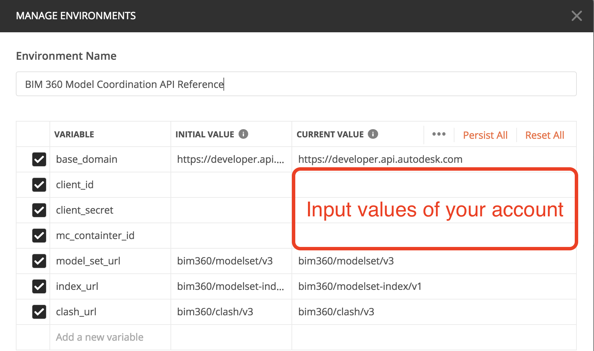
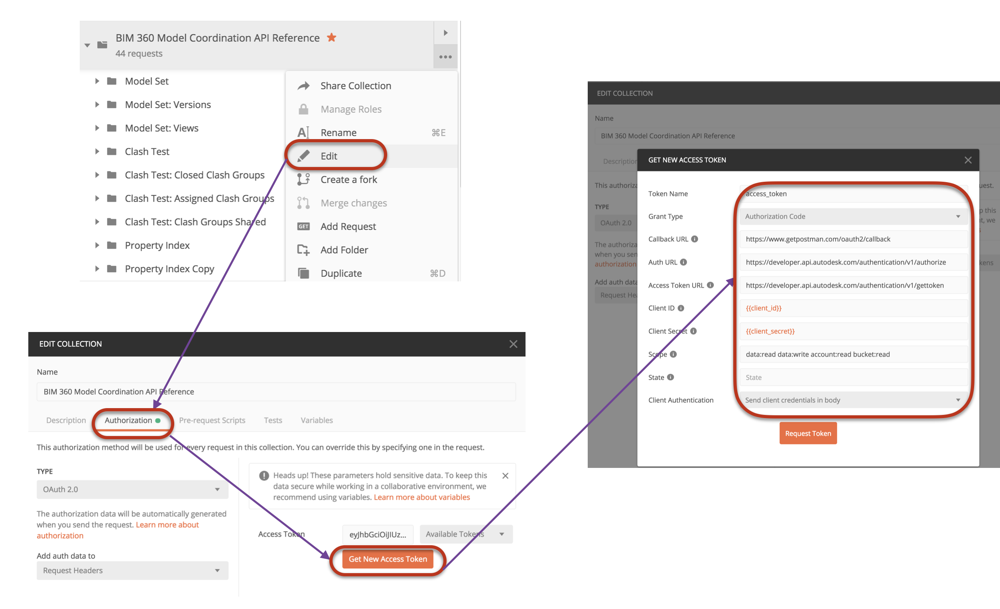
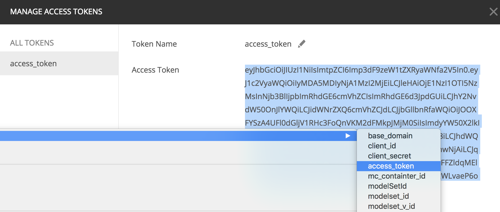
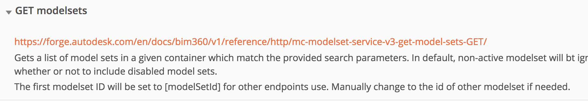

# Postman Collection for BIM360 Model Coordination API Reference

## Description

This collection follows the endpoint schema of [API Reference](https://forge.autodesk.com/en/edocs/bim360/v1/reference/http/mc-modelset-service-v3-create-model-set-POST/) of **Model Coordination API**.

## Steps 

1. **Forge Account**: Learn how to create a Forge Account, activate the subscription and create an app by [this tutorial](http://learnforge.autodesk.io/#/account/). Get Forge _client id_, _client secret_ and  _callback url_. Please register Forge app with the _callback url_ as 

    ```https://www.getpostman.com/oauth2/callback```

2. **BIM 360 Account and project**: must be Account Admin to add the app integration. [Learn about provisioning](https://forge.autodesk.com/blog/bim-360-docs-provisioning-forge-apps). Make a not with the _account id_ and  _project id_.

3. Ensure [Model Coordination](https://knowledge.autodesk.com/support/bim-360/learn-explore/caas/CloudHelp/cloudhelp/ENU/BIM360D-Model-Coordination/files/GUID-38CC3A1C-92FF-4682-847F-9CFAFCC4CCCE-html.html) module has been activated in BIM 360 project. Make a note with the __project id__ (without 'b.').

4. Import collection and enviroment json to Postman.

5. In enviroment, input _client id_, _client secret_ and __mc_container_id__ (= __project id__ )

   <p align="center"></p> 

6. In context menu of collection >> **Edit**, switch to the tab **Authorization**. Click **Get New Access Token**, input the variables as below:

   - Grant Type ``Authorization Code``
   
   - Callback URL  ``https://www.getpostman.com/oauth2/callback``

   - Auth URL  ``https://developer.api.autodesk.com/authentication/v1/authorize``

   - Access Token URL  ``https://developer.api.autodesk.com/authentication/v1/gettoken``

   - Client ID ``{{client_id}}``

   - Client Secret ``{{client_secret}}``

   - Scope ``data:read data:write account:read bucket:read``

   - Client Authentication ``Send Client credentials body``

   <p align="center"></p> 
 
 7. Click **Request Token**, it will direct to login Autodesk account, after it succeeds, the token will be generated. Click **Use Token**. Then, click **Update** to close the window of **Edit**

   <p align="center"></p> 

 8. Start to test the endpoint of API. In each endpoint, some comments are enclosed for reference. Please check if there is any trick when you are stuck with the test. 
    <p align="center"></p>
  And also check [API Reference](https://forge.autodesk.com/en/docs/bim360/v1/reference/http/mc-modelset-service-v3-create-model-set-POST/) for details of the endpoint.