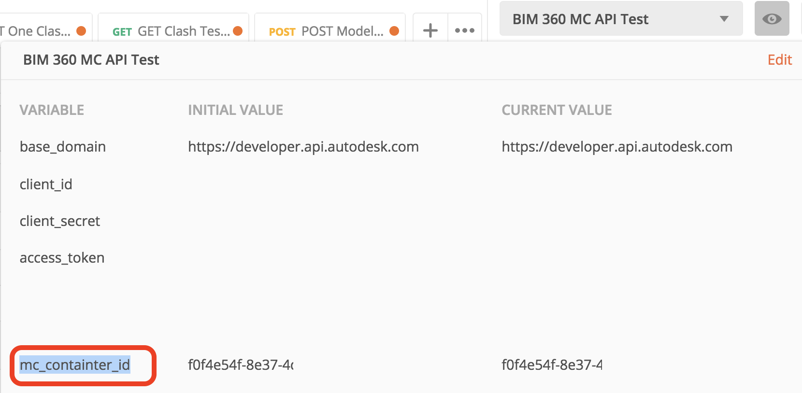
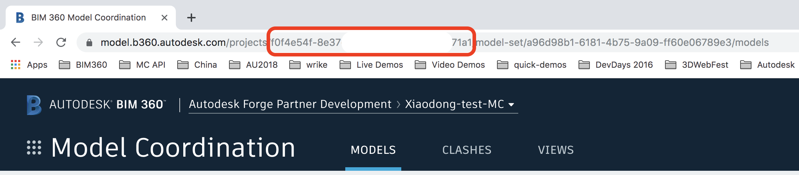
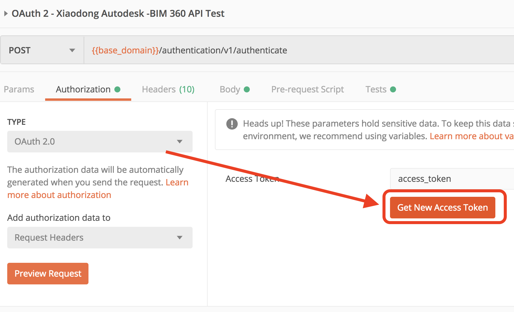
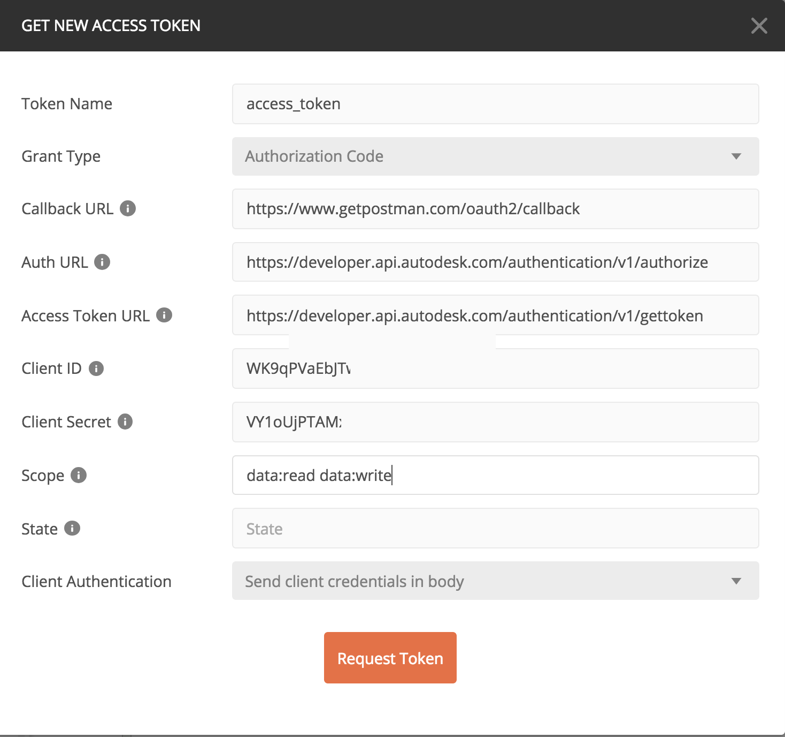

# bim360-mc.api-test

Steps:
1.	This script assumes the container id of Model Coordination has been achieved by other scripts. The container id is the id of BIM360 project.

  

 It can also be achieved on BIM 360 UI manually.

   

2.	Input oAuth credentials, following the steps at: https://forge.autodesk.com/en/docs/oauth/v2/tutorials/get-3-legged-token/ 

  

  
 
3.	Get access token by logging a user of the project.
4.	Play the scripts

## Tricks and Tips
1. Check _description_ of the scripts if there is any notes on the usage.
2. The **Modelset** collection provides the scripts to create modelset, while it is suggested play with scripts of GET at the beginning, so firstly create some modelsets in BIM 360 UI manually
3. Some APIs of MC is a job, such as **modelset/version creation**, **Index (Object metadata) query**, **clash issue creating** etc. Check job status by other endpoints named with [Get *** Job Status]. 
4. Some APIs requires **documents** data such as _documentLineage urn_ . Try with other APIs to get the data and input as payload parameters.

## License

This sample is licensed under the terms of the [MIT License](http://opensource.org/licenses/MIT). Please see the [LICENSE](LICENSE) file for full details.

## Written by

Xiaodong Liang [@coldwood](https://twitter.com/coldwood), [Forge Partner Development](http://forge.autodesk.com)
